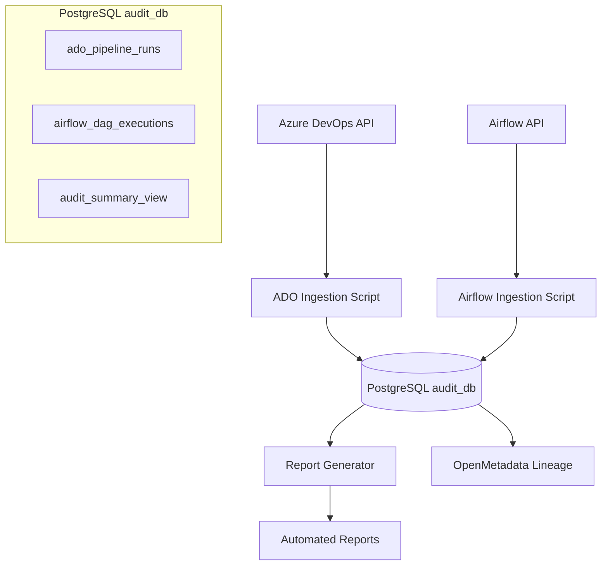

# PostgreSQL Audit System - Implementation Plan

**Goal:** Replace file-based audit logs with PostgreSQL tables for scalable audit data storage, automated ingestion, and SQL-based reporting.

**Problem Solved:** Current `audit_log.jsonl` approach doesn't scale for historical analysis, complex queries, or automated reporting. Moving to PostgreSQL enables:
- Historical trend analysis
- Complex compliance queries 
- Automated report generation
- Integration with BI tools
- Better data integrity and backup

---

## Architecture Overview



---

## Task 1: PostgreSQL Schema Design

### Database Structure

**Database:** `audit_db`  
**Schema:** `audit` (separate from public for organization)  

### Table 1: `audit.ado_pipeline_runs`

```sql
CREATE TABLE audit.ado_pipeline_runs (
    -- Primary Keys
    run_id INTEGER PRIMARY KEY,
    run_number VARCHAR(50) NOT NULL,
    
    -- Pipeline Information
    pipeline_name VARCHAR(255) NOT NULL,
    pipeline_type VARCHAR(50) NOT NULL CHECK (pipeline_type IN ('build', 'deploy')),
    pipeline_subtype VARCHAR(50) NOT NULL CHECK (pipeline_subtype IN ('image_build', 'infra_deploy')),
    
    -- Execution Details
    result VARCHAR(20) NOT NULL CHECK (result IN ('succeeded', 'failed', 'canceled', 'running')),
    environment VARCHAR(10) CHECK (environment IN ('dev', 'uat', 'prd')),
    queue_time TIMESTAMPTZ NOT NULL,
    start_time TIMESTAMPTZ,
    finish_time TIMESTAMPTZ,
    duration_seconds INTEGER GENERATED ALWAYS AS (EXTRACT(EPOCH FROM (finish_time - start_time))) STORED,
    
    -- Code & Approval Information
    git_sha VARCHAR(40),
    source_branch VARCHAR(255),
    requested_by VARCHAR(255),
    approved_by VARCHAR(255),
    approval_timestamp TIMESTAMPTZ,
    
    -- Build Artifacts
    image_tag VARCHAR(100),
    version VARCHAR(50),
    
    -- Metadata
    ado_project VARCHAR(100) NOT NULL,
    ado_org_url VARCHAR(500) NOT NULL,
    raw_data JSONB, -- Store original ADO response
    
    -- Audit Fields
    ingested_at TIMESTAMPTZ DEFAULT NOW(),
    ingested_by VARCHAR(100) DEFAULT 'ado_ingestion_script',
    
    -- Indexes
    CONSTRAINT uk_ado_run UNIQUE (run_id, ado_project)
);

-- Indexes for performance
CREATE INDEX idx_ado_pipeline_runs_date ON audit.ado_pipeline_runs (DATE(queue_time));
CREATE INDEX idx_ado_pipeline_runs_pipeline ON audit.ado_pipeline_runs (pipeline_name);
CREATE INDEX idx_ado_pipeline_runs_result ON audit.ado_pipeline_runs (result);
CREATE INDEX idx_ado_pipeline_runs_env ON audit.ado_pipeline_runs (environment);
CREATE INDEX idx_ado_pipeline_runs_type ON audit.ado_pipeline_runs (pipeline_type, pipeline_subtype);
```

### Table 2: `audit.airflow_dag_executions`

```sql
CREATE TABLE audit.airflow_dag_executions (
    -- Primary Keys
    dag_run_id VARCHAR(255) PRIMARY KEY,
    dag_id VARCHAR(255) NOT NULL,
    
    -- Execution Details  
    execution_date TIMESTAMPTZ NOT NULL,
    start_date TIMESTAMPTZ,
    end_date TIMESTAMPTZ,
    duration_seconds INTEGER GENERATED ALWAYS AS (EXTRACT(EPOCH FROM (end_date - start_date))) STORED,
    state VARCHAR(20) NOT NULL CHECK (state IN ('success', 'failed', 'running', 'upstream_failed', 'skipped')),
    
    -- Task Information
    total_tasks INTEGER,
    successful_tasks INTEGER,
    failed_tasks INTEGER,
    skipped_tasks INTEGER,
    
    -- Data Metrics
    data_volume_gb DECIMAL(10,3),
    processed_records BIGINT,
    
    -- Configuration
    conf JSONB, -- DAG run configuration
    environment VARCHAR(10) CHECK (environment IN ('dev', 'uat', 'prd')),
    airflow_instance VARCHAR(255) NOT NULL,
    
    -- Lineage Information
    upstream_datasets TEXT[], -- Input datasets
    downstream_datasets TEXT[], -- Output datasets  
    
    -- Error Information
    error_message TEXT,
    failed_task_id VARCHAR(255),
    
    -- Metadata
    raw_data JSONB, -- Store original Airflow response
    
    -- Audit Fields
    ingested_at TIMESTAMPTZ DEFAULT NOW(),
    ingested_by VARCHAR(100) DEFAULT 'airflow_ingestion_script',
    
    -- Constraints
    CONSTRAINT uk_airflow_dag_run UNIQUE (dag_run_id, dag_id, airflow_instance)
);

-- Indexes for performance
CREATE INDEX idx_airflow_dag_executions_date ON audit.airflow_dag_executions (DATE(execution_date));
CREATE INDEX idx_airflow_dag_executions_dag ON audit.airflow_dag_executions (dag_id);
CREATE INDEX idx_airflow_dag_executions_state ON audit.airflow_dag_executions (state);
CREATE INDEX idx_airflow_dag_executions_env ON audit.airflow_dag_executions (environment);
```

### View 3: `audit.audit_summary_view` (for reporting)

```sql
CREATE VIEW audit.audit_summary_view AS
SELECT 
    'ADO' as source_system,
    DATE(queue_time) as execution_date,
    pipeline_name as job_name,
    pipeline_type as job_type,
    pipeline_subtype as job_category, 
    result as status,
    environment,
    duration_seconds,
    approved_by,
    requested_by,
    git_sha,
    ingested_at
FROM audit.ado_pipeline_runs

UNION ALL

SELECT 
    'Airflow' as source_system,
    DATE(execution_date) as execution_date,
    dag_id as job_name,
    'data_pipeline' as job_type,
    'etl' as job_category,
    state as status,
    environment,
    duration_seconds,
    NULL as approved_by, -- Airflow doesn't have approvals
    NULL as requested_by,
    NULL as git_sha,
    ingested_at
FROM audit.airflow_dag_executions

ORDER BY execution_date DESC, ingested_at DESC;
```

---

## Task 2: ADO Automated Ingestion

### Enhanced `ado_postgres_ingestion.py`

**File:** `ingestion/src/metadata/ingestion/source/pipeline/ado_postgres_ingestion.py`

```python
"""
ADO to PostgreSQL automated ingestion script.
Fetches ADO pipeline runs and stores them in audit.ado_pipeline_runs table.
"""

import asyncpg
import asyncio
import logging
from datetime import datetime, timedelta
from typing import List, Dict, Optional
from dataclasses import dataclass
from pathlib import Path
import json

@dataclass
class AdoIngestConfig:
    # ADO Configuration
    ado_pat: str
    ado_org_url: str  
    ado_project: str
    
    # PostgreSQL Configuration
    pg_host: str = "localhost"
    pg_port: int = 5432
    pg_database: str = "audit_db"
    pg_user: str = "postgres"
    pg_password: str
    
    # Ingestion Configuration
    lookback_days: int = 30
    batch_size: int = 100
    dry_run: bool = False

class AdoPostgresIngestion:
    def __init__(self, config: AdoIngestConfig):
        self.config = config
        self.logger = logging.getLogger(__name__)
        
    async def run_incremental_ingestion(self):
        """Main entry point for incremental ingestion."""
        
        # Get last ingestion timestamp
        last_run = await self._get_last_ingestion_timestamp()
        since_date = last_run or datetime.utcnow() - timedelta(days=self.config.lookback_days)
        
        self.logger.info(f"Starting ADO ingestion since {since_date}")
        
        # Fetch new ADO runs
        ado_runs = await self._fetch_ado_runs_since(since_date)
        self.logger.info(f"Found {len(ado_runs)} new/updated ADO runs")
        
        if not self.config.dry_run:
            # Insert into PostgreSQL
            await self._bulk_upsert_runs(ado_runs)
            self.logger.info(f"Successfully ingested {len(ado_runs)} ADO runs")
        
        return len(ado_runs)
    
    async def _get_last_ingestion_timestamp(self) -> Optional[datetime]:
        """Get the most recent ingestion timestamp."""
        conn = await self._get_pg_connection()
        try:
            query = """
                SELECT MAX(queue_time) 
                FROM audit.ado_pipeline_runs 
                WHERE ingested_by = 'ado_ingestion_script'
            """
            result = await conn.fetchval(query)
            return result
        finally:
            await conn.close()
    
    async def _fetch_ado_runs_since(self, since_date: datetime) -> List[Dict]:
        """Fetch ADO runs using REST API."""
        # Implementation similar to existing ado_dump.py but with:
        # 1. Async HTTP calls for better performance
        # 2. Incremental fetching based on since_date
        # 3. Enhanced data mapping for PostgreSQL schema
        pass
    
    async def _bulk_upsert_runs(self, runs: List[Dict]):
        """Bulk upsert ADO runs into PostgreSQL."""
        conn = await self._get_pg_connection()
        try:
            upsert_query = """
                INSERT INTO audit.ado_pipeline_runs (
                    run_id, run_number, pipeline_name, pipeline_type, pipeline_subtype,
                    result, environment, queue_time, start_time, finish_time,
                    git_sha, source_branch, requested_by, approved_by, approval_timestamp,
                    image_tag, version, ado_project, ado_org_url, raw_data
                ) VALUES ($1, $2, $3, $4, $5, $6, $7, $8, $9, $10, $11, $12, $13, $14, $15, $16, $17, $18, $19, $20)
                ON CONFLICT (run_id, ado_project) 
                DO UPDATE SET 
                    result = EXCLUDED.result,
                    finish_time = EXCLUDED.finish_time,
                    duration_seconds = EXCLUDED.duration_seconds,
                    approved_by = COALESCE(EXCLUDED.approved_by, ado_pipeline_runs.approved_by),
                    raw_data = EXCLUDED.raw_data,
                    ingested_at = NOW()
            """
            
            await conn.executemany(upsert_query, [self._map_run_to_pg(run) for run in runs])
        finally:
            await conn.close()
    
    async def _get_pg_connection(self):
        """Get PostgreSQL connection."""
        return await asyncpg.connect(
            host=self.config.pg_host,
            port=self.config.pg_port,
            database=self.config.pg_database,
            user=self.config.pg_user,
            password=self.config.pg_password
        )

# CLI entry point
async def main():
    config = AdoIngestConfig(
        ado_pat=os.getenv("ADO_PAT"),
        ado_org_url=os.getenv("ADO_ORG_URL"),
        ado_project=os.getenv("ADO_PROJECT"),
        pg_password=os.getenv("POSTGRES_PASSWORD"),
        lookback_days=int(os.getenv("LOOKBACK_DAYS", "7"))
    )
    
    ingestion = AdoPostgresIngestion(config)
    await ingestion.run_incremental_ingestion()

if __name__ == "__main__":
    asyncio.run(main())
```

### Scheduling with cron

```bash
# /etc/cron.d/ado-ingestion
# Run ADO ingestion every 15 minutes during business hours
*/15 6-18 * * 1-5 python3 /path/to/ado_postgres_ingestion.py >> /var/log/ado-ingestion.log 2>&1

# Run full sync daily at 2 AM
0 2 * * * LOOKBACK_DAYS=30 python3 /path/to/ado_postgres_ingestion.py >> /var/log/ado-ingestion-daily.log 2>&1
```

---

## Task 3: Airflow Automated Ingestion

### Enhanced `airflow_postgres_ingestion.py`

**File:** `ingestion/src/metadata/ingestion/source/pipeline/airflow_postgres_ingestion.py`

```python
"""
Airflow to PostgreSQL automated ingestion script.
Fetches Airflow DAG runs and stores them in audit.airflow_dag_executions table.
"""

import asyncpg
import asyncio
import aiohttp
from datetime import datetime, timedelta
from typing import List, Dict, Optional

class AirflowPostgresIngestion:
    def __init__(self, airflow_url: str, username: str, password: str, pg_config: dict):
        self.airflow_url = airflow_url.rstrip('/')
        self.auth = aiohttp.BasicAuth(username, password)
        self.pg_config = pg_config
        self.logger = logging.getLogger(__name__)
    
    async def run_incremental_ingestion(self):
        """Main entry point for incremental ingestion."""
        
        # Get last ingestion timestamp
        last_run = await self._get_last_execution_date()
        since_date = last_run or datetime.utcnow() - timedelta(days=30)
        
        self.logger.info(f"Starting Airflow ingestion since {since_date}")
        
        async with aiohttp.ClientSession(auth=self.auth) as session:
            # Fetch DAG runs
            dag_runs = await self._fetch_dag_runs_since(session, since_date)
            
            # Enrich with task details
            enriched_runs = []
            for run in dag_runs:
                enriched = await self._enrich_with_task_details(session, run)
                enriched_runs.append(enriched)
            
            self.logger.info(f"Found {len(enriched_runs)} Airflow DAG runs")
            
            # Insert into PostgreSQL
            await self._bulk_upsert_dag_runs(enriched_runs)
        
        return len(enriched_runs)
    
    async def _fetch_dag_runs_since(self, session: aiohttp.ClientSession, since_date: datetime) -> List[Dict]:
        """Fetch DAG runs from Airflow API."""
        url = f"{self.airflow_url}/api/v1/dags/~/dagRuns"
        params = {
            "limit": 1000,
            "order_by": "-execution_date",
            "start_date_gte": since_date.isoformat()
        }
        
        async with session.get(url, params=params) as response:
            response.raise_for_status()
            data = await response.json()
            return data.get('dag_runs', [])
    
    async def _enrich_with_task_details(self, session: aiohttp.ClientSession, dag_run: Dict) -> Dict:
        """Enrich DAG run with task execution details."""
        dag_id = dag_run['dag_id']
        dag_run_id = dag_run['dag_run_id']
        
        # Fetch task instances
        url = f"{self.airflow_url}/api/v1/dags/{dag_id}/dagRuns/{dag_run_id}/taskInstances"
        
        try:
            async with session.get(url) as response:
                response.raise_for_status()
                tasks_data = await response.json()
                tasks = tasks_data.get('task_instances', [])
                
                # Calculate task statistics
                dag_run['total_tasks'] = len(tasks)
                dag_run['successful_tasks'] = len([t for t in tasks if t['state'] == 'success'])
                dag_run['failed_tasks'] = len([t for t in tasks if t['state'] == 'failed'])
                dag_run['skipped_tasks'] = len([t for t in tasks if t['state'] == 'skipped'])
                
                # Find error information
                failed_tasks = [t for t in tasks if t['state'] == 'failed']
                if failed_tasks:
                    dag_run['failed_task_id'] = failed_tasks[0]['task_id']
                    # Could fetch logs for error message here
                
        except Exception as e:
            self.logger.warning(f"Could not fetch tasks for {dag_id}/{dag_run_id}: {e}")
        
        return dag_run
    
    async def _bulk_upsert_dag_runs(self, dag_runs: List[Dict]):
        """Bulk upsert DAG runs into PostgreSQL."""
        conn = await asyncpg.connect(**self.pg_config)
        try:
            upsert_query = """
                INSERT INTO audit.airflow_dag_executions (
                    dag_run_id, dag_id, execution_date, start_date, end_date,
                    state, total_tasks, successful_tasks, failed_tasks, skipped_tasks,
                    data_volume_gb, processed_records, conf, environment, airflow_instance,
                    upstream_datasets, downstream_datasets, error_message, failed_task_id, raw_data
                ) VALUES ($1, $2, $3, $4, $5, $6, $7, $8, $9, $10, $11, $12, $13, $14, $15, $16, $17, $18, $19, $20)
                ON CONFLICT (dag_run_id, dag_id, airflow_instance)
                DO UPDATE SET 
                    state = EXCLUDED.state,
                    end_date = EXCLUDED.end_date,
                    successful_tasks = EXCLUDED.successful_tasks,
                    failed_tasks = EXCLUDED.failed_tasks,
                    raw_data = EXCLUDED.raw_data,
                    ingested_at = NOW()
            """
            
            await conn.executemany(upsert_query, [self._map_dag_run_to_pg(run) for run in dag_runs])
        finally:
            await conn.close()
```

### Scheduling with cron

```bash
# /etc/cron.d/airflow-ingestion
# Run Airflow ingestion every 10 minutes
*/10 * * * * python3 /path/to/airflow_postgres_ingestion.py >> /var/log/airflow-ingestion.log 2>&1

# Run full sync daily at 3 AM  
0 3 * * * LOOKBACK_DAYS=30 python3 /path/to/airflow_postgres_ingestion.py >> /var/log/airflow-ingestion-daily.log 2>&1
```

---

## Task 4: Automated Report Generation

### Report Generator Script

**File:** `ingestion/src/metadata/ingestion/source/pipeline/audit_report_generator.py`

```python
"""
Automated audit report generator using PostgreSQL data.
Generates daily, weekly, and monthly compliance reports.
"""

import asyncpg
from jinja2 import Template
from datetime import datetime, timedelta
import argparse

class AuditReportGenerator:
    def __init__(self, pg_config: dict, report_config: dict):
        self.pg_config = pg_config
        self.report_config = report_config
    
    async def generate_30_day_report(self) -> str:
        """Generate 30-day audit report."""
        conn = await asyncpg.connect(**self.pg_config)
        try:
            end_date = datetime.utcnow()
            start_date = end_date - timedelta(days=30)
            
            # Executive Summary
            summary_data = await self._get_summary_metrics(conn, start_date, end_date)
            
            # ADO Pipeline Runs
            ado_runs = await self._get_ado_runs_detail(conn, start_date, end_date)
            
            # Airflow DAG Executions  
            airflow_runs = await self._get_airflow_runs_detail(conn, start_date, end_date)
            
            # Compliance Analysis
            compliance_data = await self._get_compliance_metrics(conn, start_date, end_date)
            
            # Generate report using template
            report = self._render_report_template({
                'summary': summary_data,
                'ado_runs': ado_runs,
                'airflow_runs': airflow_runs,
                'compliance': compliance_data,
                'period_start': start_date,
                'period_end': end_date,
                'generated_at': datetime.utcnow()
            })
            
            return report
            
        finally:
            await conn.close()
    
    async def _get_summary_metrics(self, conn, start_date: datetime, end_date: datetime) -> dict:
        """Get executive summary metrics."""
        query = """
            SELECT 
                source_system,
                COUNT(*) as total_executions,
                COUNT(*) FILTER (WHERE status IN ('succeeded', 'success')) as successful,
                COUNT(*) FILTER (WHERE status IN ('failed')) as failed,
                ROUND(AVG(duration_seconds)) as avg_duration_seconds,
                COUNT(DISTINCT DATE(execution_date)) as active_days
            FROM audit.audit_summary_view 
            WHERE execution_date BETWEEN $1 AND $2
            GROUP BY source_system
        """
        
        rows = await conn.fetch(query, start_date.date(), end_date.date())
        return [dict(row) for row in rows]
    
    async def _get_compliance_metrics(self, conn, start_date: datetime, end_date: datetime) -> dict:
        """Get compliance and governance metrics."""
        
        # Approval coverage
        approval_query = """
            SELECT 
                COUNT(*) as total_deployments,
                COUNT(*) FILTER (WHERE approved_by IS NOT NULL) as approved_deployments,
                ROUND(100.0 * COUNT(*) FILTER (WHERE approved_by IS NOT NULL) / COUNT(*), 1) as approval_percentage
            FROM audit.ado_pipeline_runs
            WHERE pipeline_type = 'deploy' 
            AND environment = 'prd'
            AND DATE(queue_time) BETWEEN $1 AND $2
        """
        
        approval_data = await conn.fetchrow(approval_query, start_date.date(), end_date.date())
        
        # Infrastructure success rate
        infra_query = """
            SELECT 
                COUNT(*) as total_infra_deployments,
                COUNT(*) FILTER (WHERE result = 'succeeded') as successful_infra_deployments,
                ROUND(100.0 * COUNT(*) FILTER (WHERE result = 'succeeded') / COUNT(*), 1) as infra_success_rate
            FROM audit.ado_pipeline_runs
            WHERE pipeline_subtype = 'infra_deploy'
            AND DATE(queue_time) BETWEEN $1 AND $2
        """
        
        infra_data = await conn.fetchrow(infra_query, start_date.date(), end_date.date())
        
        return {
            'approval_coverage': dict(approval_data),
            'infrastructure_reliability': dict(infra_data)
        }

# Report Templates
REPORT_TEMPLATE = """
# 30-Day Data Pipeline Audit Report
**Reporting Period:** {{ period_start.strftime('%B %d, %Y') }} - {{ period_end.strftime('%B %d, %Y') }}
**Generated:** {{ generated_at.strftime('%B %d, %Y at %H:%M UTC') }}

## Executive Summary

**{{ system.source_system }}:**
- Total Executions: {{ system.total_executions }}
- Success Rate: {{ "%.1f"|format(100.0 * system.successful / system.total_executions) }}%
- Average Duration: {{ system.avg_duration_seconds // 60 }}m {{ system.avg_duration_seconds % 60 }}s


## Compliance Summary
- **Approval Coverage:** {{ compliance.approval_coverage.approval_percentage }}% ({{ compliance.approval_coverage.approved_deployments }}/{{ compliance.approval_coverage.total_deployments }})
- **Infrastructure Success Rate:** {{ compliance.infrastructure_reliability.infra_success_rate }}%

## Detailed Analysis
[Report continues with detailed tables...]
"""

# CLI Usage
async def main():
    parser = argparse.ArgumentParser(description='Generate audit reports')
    parser.add_argument('--report-type', choices=['daily', 'weekly', 'monthly'], default='monthly')
    parser.add_argument('--output', help='Output file path')
    parser.add_argument('--format', choices=['markdown', 'html', 'pdf'], default='markdown')
    
    args = parser.parse_args()
    
    pg_config = {
        'host': os.getenv('POSTGRES_HOST', 'localhost'),
        'database': 'audit_db',
        'user': os.getenv('POSTGRES_USER', 'postgres'),
        'password': os.getenv('POSTGRES_PASSWORD')
    }
    
    generator = AuditReportGenerator(pg_config, {})
    report = await generator.generate_30_day_report()
    
    if args.output:
        with open(args.output, 'w') as f:
            f.write(report)
    else:
        print(report)

if __name__ == "__main__":
    asyncio.run(main())
```

---

## Task 5: Integration with OpenMetadata

### Enhanced OpenMetadata Integration

The PostgreSQL tables become **native data sources** in OpenMetadata:

```python
# In smoke_ingest.py - add PostgreSQL audit tables as OM entities

def create_audit_database_entities(client):
    """Create OpenMetadata entities for PostgreSQL audit tables."""
    
    # 1. Database Service (already exists: postgres_pipeline)
    
    # 2. Add audit schema
    audit_schema = client.create_database_schema(
        service_name="postgres_pipeline",
        database_name="audit_db", 
        schema_name="audit",
        description="Audit and compliance schema for pipeline execution tracking"
    )
    
    # 3. Create ado_pipeline_runs table entity
    ado_table = client.create_table(
        service_name="postgres_pipeline",
        database_name="audit_db",
        schema_name="audit",
        table_name="ado_pipeline_runs",
        columns=[
            {"name": "run_id", "dataType": "INT", "description": "Unique ADO run identifier"},
            {"name": "pipeline_name", "dataType": "VARCHAR", "description": "Name of the ADO pipeline"},
            {"name": "result", "dataType": "VARCHAR", "description": "Pipeline execution result"},
            # ... full column definitions
        ],
        description="Azure DevOps pipeline execution audit log"
    )
    
    # 4. Create airflow_dag_executions table entity
    airflow_table = client.create_table(
        service_name="postgres_pipeline", 
        database_name="audit_db",
        schema_name="audit", 
        table_name="airflow_dag_executions",
        columns=[
            {"name": "dag_run_id", "dataType": "VARCHAR", "description": "Unique Airflow DAG run identifier"},
            {"name": "dag_id", "dataType": "VARCHAR", "description": "Airflow DAG name"},
            {"name": "state", "dataType": "VARCHAR", "description": "DAG execution state"},
            # ... full column definitions
        ],
        description="Airflow DAG execution audit log"
    )
    
    # 5. Create lineage from audit tables to gold tables
    client.add_lineage(
        from_entity=f"postgres_pipeline.audit_db.audit.ado_pipeline_runs",
        to_entity="postgres_pipeline.warehouse.public.dim_sf_members_scd2",
        description="ADO deployments enable data pipeline processing"
    )
    
    client.add_lineage(
        from_entity=f"postgres_pipeline.audit_db.audit.airflow_dag_executions", 
        to_entity="postgres_pipeline.warehouse.public.dim_sf_members_scd2",
        description="Airflow DAGs populate gold layer tables"
    )
```

---

## Deployment Plan

### Phase 1: Database Setup (Week 1)
1. Create PostgreSQL `audit_db` database
2. Execute schema creation scripts
3. Set up database users and permissions
4. Create initial indexes and views

### Phase 2: ADO Ingestion (Week 2)
1. Implement `ado_postgres_ingestion.py`
2. Test with historical data backfill
3. Set up cron scheduling
4. Monitor and validate data quality

### Phase 3: Airflow Ingestion (Week 3)
1. Implement `airflow_postgres_ingestion.py`
2. Test incremental ingestion
3. Set up monitoring and alerting
4. Validate data completeness

### Phase 4: Report Automation (Week 4)
1. Implement `audit_report_generator.py`
2. Create report templates (daily/weekly/monthly)
3. Set up automated report delivery
4. Create compliance dashboards

### Phase 5: OpenMetadata Integration (Week 5)
1. Register PostgreSQL audit tables in OM
2. Create lineage connections
3. Set up automated metadata refresh
4. Create compliance workflows

---

## Monitoring & Maintenance

### Data Quality Checks
```sql
-- Daily data quality validation queries
SELECT 
    'ADO missing approvals' as check_name,
    COUNT(*) as violation_count
FROM audit.ado_pipeline_runs 
WHERE pipeline_type = 'deploy' 
AND environment = 'prd' 
AND approved_by IS NULL 
AND DATE(queue_time) = CURRENT_DATE;

SELECT 
    'Airflow long-running DAGs' as check_name,
    COUNT(*) as violation_count  
FROM audit.airflow_dag_executions
WHERE duration_seconds > 7200 -- 2 hours
AND state = 'success'
AND DATE(execution_date) = CURRENT_DATE;
```

### Performance Optimization
- Partition tables by month for historical data
- Implement data retention policies (2 years)
- Create materialized views for frequent queries
- Set up connection pooling for ingestion scripts

### Benefits of PostgreSQL Approach

✅ **Scalability:** Handle millions of pipeline runs  
✅ **Query Performance:** Complex analytical queries with indexes  
✅ **Data Integrity:** ACID compliance and constraints  
✅ **Backup & Recovery:** Standard PostgreSQL backup procedures  
✅ **BI Integration:** Direct connection to Tableau, PowerBI, Grafana  
✅ **Real-time Analytics:** Live dashboards and alerts  
✅ **Compliance Reporting:** Automated regulatory reports  
✅ **Data Lineage:** Full integration with OpenMetadata ecosystem  

This approach transforms the audit system from simple file logging to enterprise-grade data infrastructure capable of supporting complex compliance and operational analytics.